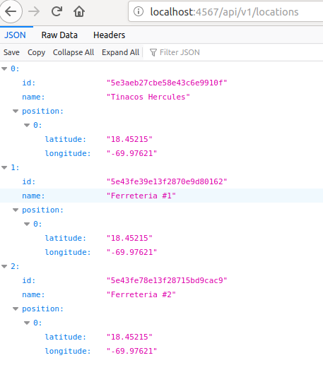
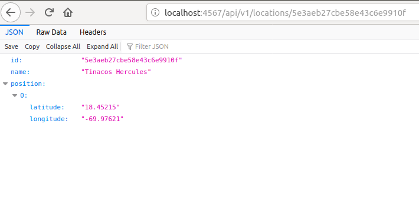

# Location API

Location API is an api used tor saving hardware stores in order to know where to locate them in the map. This is made in order to know specific location inside a map.

## Examples of the GET and also filtering via ID
### The Complete List of locations:

### Getting a Location via ID:

## License

To be made.
